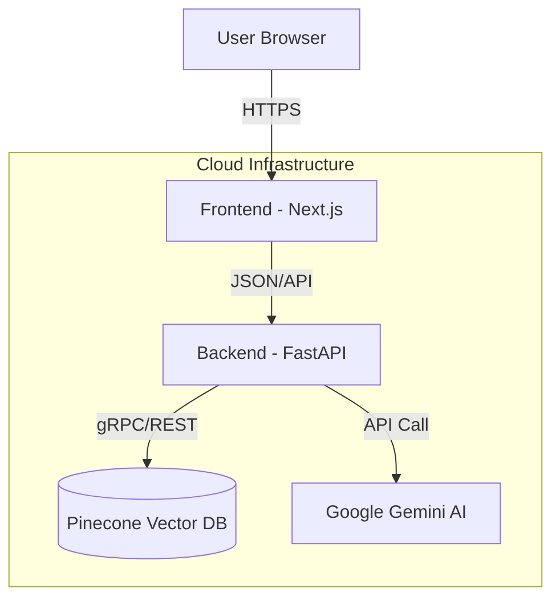

# 📄 PDF Q&A RAG Application

> An intelligent, full-stack **Retrieval-Augmented Generation (RAG)** application that lets you upload PDF documents and chat with them using AI.

Built with **Next.js** · **FastAPI** · **Google Gemini** · **Pinecone**

---

## 🌐 Live Demo

| Service | URL |
| :--- | :--- |
| **Frontend** | [pdf-qna-rag-frontend.vercel.app](https://pdf-qna-rag-frontend.vercel.app/) |
| **Backend API Docs** | [pdf-qna-rag-backend.onrender.com/docs](https://pdf-qna-rag-backend.onrender.com/docs) |

> ⚠️ **Note:** The backend runs on a free tier and may take ~30–50 seconds to "wake up" on the first request after a period of inactivity.

---

## ✨ Features

- 🤖 **AI-Powered Chat** — Ask questions about your PDF content using Google's **Gemini 1.5 Flash** model.
- 📄 **Smart Document Processing** — Automatically extracts text from PDFs (limited to 5 pages for cost optimization).
- 🔒 **Secure & Private** — API keys are stored in environment variables and never exposed to the client. Users do not need their own API keys.
- ⚡ **Real-Time Streaming** — Responses are streamed token-by-token for a smooth, chat-like experience.
- 💾 **Persistent Vector Storage** — Uses **Pinecone** to store embeddings so data survives server restarts.
- 👥 **Multi-User Isolation** — Each upload session is isolated using unique namespaces, preventing data mixing between users.
- 📱 **Responsive UI** — Clean, modern interface built with Next.js and Tailwind CSS.

---

## 🛠️ Tech Stack

| Component | Technology |
| :--- | :--- |
| **Frontend** | Next.js 14+, React, TypeScript, Tailwind CSS |
| **Backend** | Python 3.11, FastAPI, Uvicorn |
| **AI Model** | Google Generative AI (Gemini 1.5 Flash & Embedding-001) |
| **Vector DB** | Pinecone (Serverless, 768 dimensions) |
| **Orchestration** | LlamaIndex (v0.10+) |
| **Deployment** | Frontend on **Vercel**, Backend on **Render** |
| **Environment** | Anaconda (Local), Docker-compatible (Cloud) |

---

## 🏗️ Architecture



---

## 🚀 Getting Started (Local Development)

### Prerequisites

- [Node.js & npm](https://nodejs.org/)
- [Python 3.11+](https://www.python.org/) (Anaconda recommended)
- [Google Cloud API Key](https://aistudio.google.com/app/apikey) (Gemini)
- [Pinecone API Key](https://www.pinecone.io/)

---

### 1. Clone the Repository

```bash
git clone https://github.com/your-username/your-repo-name.git
cd your-repo-name
```

### 2. Backend Setup

```bash
cd backend

# Create and activate conda environment
conda create -n rag-env python=3.11
conda activate rag-env

# Install dependencies
pip install -r requirements.txt

# Configure environment variables
cp .env.example .env
# Edit .env and add your GOOGLE_API_KEY and PINECONE_API_KEY

# Start the server
python main.py
```

### 3. Frontend Setup

Open a new terminal:

```bash
cd frontend

# Install dependencies
npm install

# Configure environment variables
echo "NEXT_PUBLIC_API_URL=http://localhost:8000" > .env.local

# Start the dev server
npm run dev
```

---

## ☁️ Deployment Guide

This project uses a **split-deployment strategy** for scalability and cost-efficiency.

### Backend — [Render](https://render.com)

1. Push your code to GitHub.
2. Connect the repo to Render as a **Web Service**.
3. Set the **Root Directory** to `backend`.
4. Set the **Build Command**:
   ```
   pip install -r requirements.txt
   ```
5. Set the **Start Command**:
   ```
   uvicorn main:app --host 0.0.0.0 --port $PORT
   ```
6. Add the following **Environment Variables**:
   - `GOOGLE_API_KEY`
   - `PINECONE_API_KEY`
   - `PINECONE_ENVIRONMENT`

### Frontend — [Vercel](https://vercel.com)

1. Connect the same repo to Vercel.
2. Set the **Root Directory** to `frontend`.
3. Add the following **Environment Variable**:
   - `NEXT_PUBLIC_API_URL` → *(your Render backend URL)*
4. Deploy.

---

## ⚠️ Limitations & Notes

| Limitation | Details |
| :--- | :--- |
| **Cold Starts** | The free Render tier spins down after 15 min of inactivity. First request may take ~45 seconds. |
| **Page Limit** | Uploads are restricted to **5 pages** per PDF to manage token costs and vector storage limits. |
| **Session Memory** | Chat history is stored in server memory. A server restart clears history, but uploaded document data remains safe in Pinecone. |

---

## 🔒 Security

- **Secrets Management** — All sensitive keys are managed via environment variables and never committed to source control.
- **CORS** — Configured to allow requests only from trusted origins in production.
- **Input Validation** — File types and sizes are strictly validated before processing.

---

## 📄 License

This project is open source and available under the [MIT License](LICENSE).